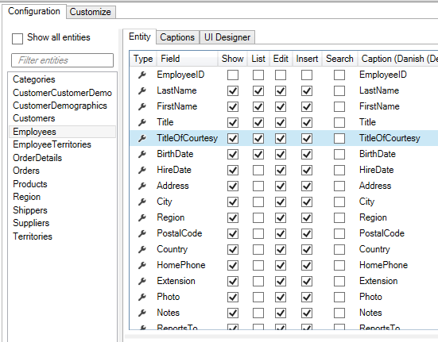
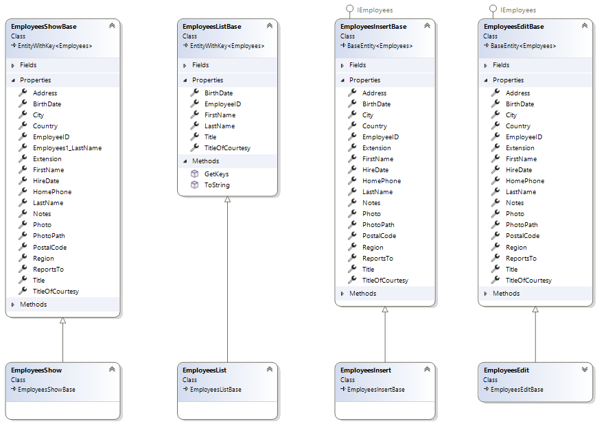

# Mapper - Custom data-property
 
When views and controls for List and Show screens are code-generated, Model classes are also created. In these classes, individual data entities are mapped using AutoMapper.

For example, for the data entity "Employees", there are the classes "EmployeesList" and "EmployeesShow", which are used in List and Show views.

The Model classes contain the properties that are selected in the Designer:



The above configuration results in the following classes:



The mapping itself is code-generated in the file "AutoMapperUIProfiles.tt.cs", as shown below:

```csharp
    public partial class EmployeesListMapperProfile : Profile
    {
        public EmployeesListMapperProfile()
        {
            var map = CreateMap<Employees, EmployeesList>()
                .ForMember(e => e.Title, opt => opt.MapFrom(e => e.Title))
                .ForMember(e => e.BirthDate, opt => opt.MapFrom(e => e.BirthDate))
                .ForMember(e => e.FullName, opt => opt.MapFrom(e => e.FullName))
                .ForMember(e => e.EmployeeID, opt => opt.MapFrom(e => e.EmployeeID))
            .IgnoreAllPropertiesWithAnInaccessibleSetter();

            AfterConfiguration(map);

            map.ForAllOtherMembers(e => e.Ignore());

        }
        partial void AfterConfiguration(IMappingExpression<Employees, EmployeesList> mapping);
    }

```

## Customization

In another example of customization [Entity](../Entity/Entity.md), the custom property "FullName" needs to be mapped to data properties.

**Requirement**: In various places in the application, the full name of an "Employees" should be displayed.

**Task**: Create a property in the Employees class that can be used to map "FirstName" and "LastName" together.

**Execution**: 

1. Select "User Interface"
2. Select "Employees"
3. Switch to the "List" tab
4. In "Code Tasks" select "MapperProfile" and click "Add Code". A file named "EmployeesListMapperProfile.cs" will now be generated.
5. Implement the partial method "AfterConfiguration" and perform the mapping, as shown below.

```csharp
        partial void AfterConfiguration(IMappingExpression<Employees, EmployeesList> mapping)
        {
            mapping.ForMember(e => e.FullName, opt => opt.MapFrom(e => $"{e.FirstName} {e.LastName}"));
        }
```

The list will now appear as follows:

