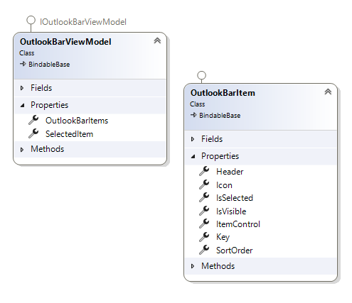
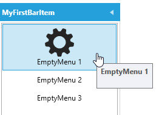
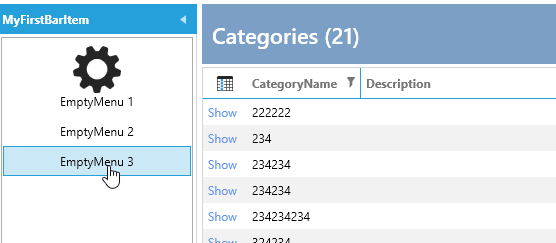
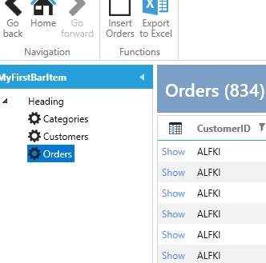

# OutlookBar

The OutlookBar is implemented in the `MainWindow` and is data-bound to an `OutlookBarViewModel`, which is injected into the `MainWindowViewModel`.

Here is a diagram of the `OutlookBarViewModel`:



It has a collection of `OutlookBarItem`, and you can add `OutlookBarItems` to that collection.

The `OutlookBarItem` has a property called `ItemControl`, which is the `UserControl` that will be shown in the `OutlookBarItem`.

To add a simple `OutlookBarItem`, you could do this in the `MainWindowViewModel`:

```csharp
         outlookBarViewModel.OutlookBarItems.Add(new OutlookBarItem()
         {
             Header = "MyFirstBarItem",
             ItemControl=new MyOutLookBarView()
         });
```

`MyOutLookBarView` is just a `UserControl` with a `TextBlock`.

It looks like this:


However, this approach is not very MVVM-friendly. To improve it, you can use the `OutlookBarService`.

## OutlookBar Service

In a module, you can override the `ConfigureOutlookBarService` method and do the following:


```csharp
        protected override void ConfigureOutlookBarService(IOutlookBarService outlookBarService)
        {

            outlookBarService
                .AddOutlookBarItem(new OutlookBarItem(){Header = "MyFirstBarItem"})
                .WithView<MyOutLookBarView>();
        }
```

Now, the view is constructed by the `IServiceProvider` instead.

In 90% of cases, your OutlookBar will display either a list of menus or a TreeView with menus.

### WithSimpleMenuView

To simplify this process, there are extensions and builders available.

To create a simple list of menus, you can write this:

```csharp
        protected override void ConfigureOutlookBarService(IOutlookBarService outlookBarService)
        {

            outlookBarService
                .AddOutlookBarItem(new OutlookBarItem(){Header = "MyFirstBarItem"})
                .WithSimpleMenuView()
                    .AddMenuItem(new MenuItemViewModel() { Title = "EmptyMenu 1",ImageSource= ImageProvider.GetImage(Innova.Prism.Library.Styles.WindowsMenuImages.gear_Keyname)?.Source })
                    .AddMenuItem(new MenuItemViewModel() { Title = "EmptyMenu 2" })
                    .AddMenuItem(new MenuItemViewModel() { Title = "EmptyMenu 3" });
        }
```

And the result is this:



You can also make both `OutlookBarItem` and `MenuItem` into classes that are constructed by the `IServiceProvider`.

Here is the `OutlookBarItem` and `Menu3` as a class. Now, you can inject dependencies like the `IEventAggregator` into the constructor, as we do in `Menu3`:

```csharp
    public class MyFirstBarItem : OutlookBarItem
    {
        public MyFirstBarItem()
        {
            Header = "MyFirstBarItem";
            SortOrder = 1;
            Icon = ImageProvider.GetImage(Innova.Prism.Library.Styles.WindowsMenuImages.gear_Keyname)?.Source;
        }
    }

    public class EmptyMenu3 : MenuItemViewModel
    {
        private readonly IEventAggregator _eventAggregator;

        public EmptyMenu3(IEventAggregator eventAggregator)
        {
            
            _eventAggregator = eventAggregator;
            Title = "EmptyMenu 3";
        }

        protected override void ExecuteCommand()
        {
            _eventAggregator.PublishListShowEvent<Data.Entity.Categories>();
        }

    }

```

And the configuration looks like this to use the classes:

```csharp
        protected override void ConfigureOutlookBarService(IOutlookBarService outlookBarService)
        {

            outlookBarService
                .AddOutlookBarItem<MyFirstBarItem>()
                .WithSimpleMenuView()
                    .AddMenuItem(new MenuItemViewModel() { Title = "EmptyMenu 1", ImageSource = ImageProvider.GetImage(Innova.Prism.Library.Styles.WindowsMenuImages.gear_Keyname)?.Source })
                    .AddMenuItem(new MenuItemViewModel() { Title = "EmptyMenu 2" })
                    .AddMenuItem<EmptyMenu3>();
        }
```

Now, when we click `Menu3`, the list of Categories is shown.



In most cases, you'll want to show a list when a menu is clicked. There are extensions for this as well:


```csharp
        protected override void ConfigureOutlookBarService(IOutlookBarService outlookBarService)
        {

            outlookBarService
                .AddOutlookBarItem<MyFirstBarItem>()
                .WithSimpleMenuView()
                    .AddMenuWithShowList<Data.Entity.Customers>()
                    .AddMenuWithShowList<Data.Entity.Orders>()
                    .AddMenuWithShowList<Data.Entity.Categories>();
        }
```

And the result looks like this:


You can also show it as a `TreeView` to create a hierarchy of menu items.

### WithTreeMenuView

If we change the code to this:

```csharp
        protected override void ConfigureOutlookBarService(IOutlookBarService outlookBarService)
        {

            outlookBarService
                .AddOutlookBarItem<MyFirstBarItem>()
                .WithTreeMenuView()
                .AddMenuItem(new MenuItemViewModel() { Title = "Heading" }, 
                    subbuilder => subbuilder
                        .AddMenuWithShowList<Data.Entity.Customers>()
                        .AddMenuWithShowList<Data.Entity.Orders>()
                        .AddMenuWithShowList<Data.Entity.Categories>());
        }
```

The result looks like this:



We have changed `WithSimpleMenuView` to `WithTreeMenuView`, added an empty `MenuItem`, and added 3 sub-menu items under that heading.
